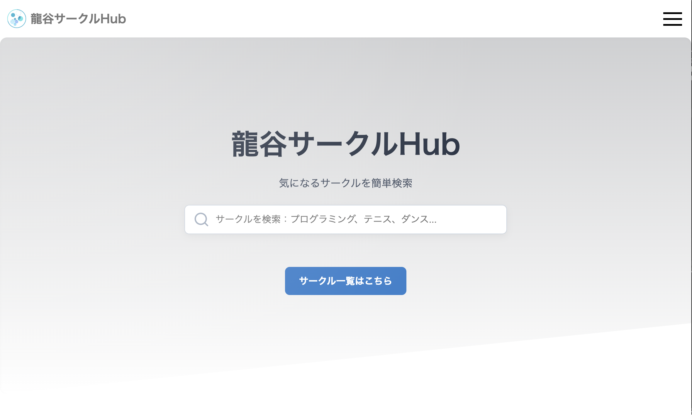

# 2025-AdvancedGroup-MidTeamDev-No2

# 龍谷サークルHub



## アプリ概要

本アプリは、reactおよびsupabase edge functionsを使って作成した龍谷大学のサークル一覧を閲覧できるアプリ。サークルごとに管理者にアカウントを配り、紹介ページをサークルの管理者がそれぞれいつでも編集できる。公認サークルでも非公認サークルでも申請があればサークル紹介ページを作成できる。サークルのカテゴリ別整理や、検索システムやAIによる「あなたに合っているサークル診断」などを実装する。主に新入生向けに自分の探しているサークルや、自分に合ったサークルを探すことができるサービス。

### サイトURL

https://ryukoku-horizon.github.io/2025-AdvancedGroup-MidTeamDev-No2/

## 起動方法

ルートディレクトリで`docker compose up`、または`docker compose up --build`を実行

ブラウザで`http://localhost:8000/2025-AdvancedGroup-MidTeamDev-No2`にアクセス

## 主な使用技術

 - supabase cli 
 - react 

## 主な機能

 - サークル紹介一覧表示
 - サークル検索
 - サークル紹介掲載申請
 - 申請時にサイト管理者にディスコードでお知らせ
 - メール送信機能（申請に対して、承認or拒否）
 - サークル紹介ページの編集機能

## ディレクトリ構成
```
/
├── frontend/ - フロントエンド
|   ├── src/
|   |   ├── components/ - コンポーネント
|   |   ├── constants/ - 定数
|   |   ├── hooks/ - カスタムフック     
|   |   ├── libs/
|   |   ├── pages/
|   |   |   ├── index.tsx - ホームページ
|   |   |   ├── search.tsx - 検索ページ
|   |   |   ├── login.tsx - ログインページ
|   |   |   ├── request.tsx - 申請ページ
|   |   |   ├── comp.tsx - 申請完了ページ
|   |   |   ├── fqa.tsx - よくある質問ページ
|   |   |   ├── ai-diagnosis.tsx - ai診断ページ
|   |   |   ├── comp.tsx - 申請完了ページ
|   |   |   ├── circles/
|   |   |   |   └── circlePage.tsx - サークル紹介ページ
|   |   |   ├── manage/
|   |   |   |   ├── circle.tsx - サークル管理ページ
|   |   |   |   ├── editProfile.tsx - サークルプロフィール編集ページ
|   |   |   |   └── pageEdit.tsx - サークルページ編集ページ 
|   |   |   └── admin/
|   |   |       └── index.tsx - adminページ
|   |   ├── styles/
|   |   |   └── global/ 
|   |   └──types/
|   |       ├── block.ts
|   |       └── Circle.ts
|   ├── Dockerfile
|   └── package.json
├── backend/ - バックエンド
|   └── supabase/
|       ├── functions/
|       |   ├── approve/
|       |   |   └── index.ts - 申請承認api
|       |   ├── auth_circle/ 
|       |   |   └── index.ts - ログインapi
|       |   ├── deny_request/
|       |   |   └── index.ts - 申請拒否api
|       |   ├── edit_circle/
|       |   |   └── index.ts - circleデータ編集api
|       |   ├── get_circle/
|       |   |   └── index.ts - circleデータ取得api
|       |   ├── get_pending/
|       |   |   └── index.ts - pendingデータ取得api
|       |   └──  insert_pending/
|       |       └── index.ts - pendingデータ挿入api
|       └── deno.json
├── docs/
└── docker-compose.yml
```
