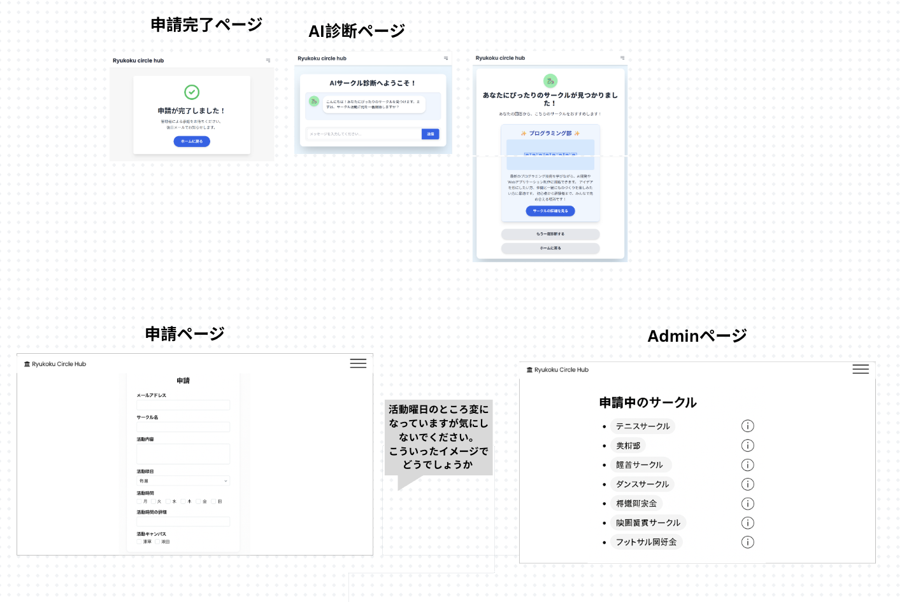

## アプリ名

Ryukoku circle Hub

## 概要

龍谷大学のサークル一覧を閲覧できるアプリ。サークルごとに管理者にアカウントを配り、紹介ページをサークルの管理者がそれぞれいつでも編集できる。公認サークルでも非公認サークルでも申請があればサークル紹介ページを作成できる。サークルのカテゴリ別整理や、検索システムやAIによる「あなたに合っているサークル診断」などを実装する。主に新入生向けに自分の探しているサークルや、自分に合ったサークルを探すことができるサービス。

## 開発動機

現在の龍谷大学公式のサークル紹介ページが使いづらい。

公式ページには以下の問題がある

- サークルの説明が浅く、サークルによっては何のサークルかわからないものもある
- サークルの紹介をサークルの運営者が更新できない
- 検索システムがないため、探すのが大変
- 所属組織とキャンパスによって分類されているが、それ以外の分類がされていない
- 公認サークルしか載っていないため、非公認サークルを見れない

上記の問題を解決するサークルのHubサイトを作ろうと言うのが、動機である。

## プラットフォーム

web

## 機能

ログイン

ログアウト

アカウント登録

ページをアカウントの保持者が編集できる

ページを検索できる

- タグ検索
- キーワード検索

AIサークル診断

サークル一覧表示

## ページ

ホームページ “/”

ログインページ “/login”

申請ページ”/request”

検索ページ”/serch” ”?q=”

管理者ページ”/admin”

申請者一覧ページ”/admin/request-list”

AIの診断ページ”/diagnosis”

サークル紹介ページ”/intro/:id”

サークル管理ページ”/manage/:id”

紹介ページ編集ページ”/manage/:id/editPage”

プロフィール編集ページ”/manage/:id/editProfile”




## データベース

**Users**

- id
- password

**Pending（保留中のデータ保存用）**

- id
- name
- location
- email
- activeDate

**Circles**

- id
- name　（サークルの名前）
- location　（サークルの活動場所）
- activeDate　（サークルの活動日）
- email

**PageData**

- id
- type
- content
- circleId

## ユーザー種別と権限

| ユーザー種別 | 権限 |
| --- | --- |
| 一般ユーザー（閲覧者） | サークル検索、診断、ページ閲覧 |
| サークル管理者 | 自サークルの紹介・プロフィール編集 |
| 管理者（システム側） | 申請の承認・削除、全データの閲覧・管理 |

## 使用技術

フロントエンド
s
react
gatsby

バックエンド

firebase

supabase

## プロジェクトフォルダ構成

- /app（フロントエンドreact/gatsbyプロジェクトフォルダ）
    - /src（ソースコード）
- /backend（バックエンドsupabase edge関数）
- /docs（仕様書保管）

# API仕様

### エンドポイント

- POST `/functions/v1/auth_circle`

### 概要

ログイン処理を行う

### レスポンス

成功時

```json
{
  success:true,
  token: {jwtトークン}
}
```

失敗時

```json
{
	success:false,
	error:"パスワードが無効です"
}
```

### エンドポイント

- POST `/functions/v1/approve`

### 概要

申請を承認する

申請者にメールを送る

### レスポンス

成功時

```json
{
  success:true
}
```

失敗時

```json
{
	success:false,
	error:"メールの送信に失敗しました"
}
```

### エンドポイント

- POST `/functions/v1/deny_request`

### 概要

申請を拒否する

申請者にメールを送る

### レスポンス

成功時

```json
{
  success:true
}
```

失敗時

```json
{
	success:false,
	error:"メールの送信に失敗しました"
}
```

### エンドポイント

- POST `/functions/v1/get_pending`

### 概要

Pendingテーブルからデータを取得する

### リクエスト

- match（条件）
    - 例：{”id”:1}（idが1のレコード取得）
- select（取得するフィールド）
    - 例：{”name”}（nameフィールドを取得）

### レスポンス

成功時

```json
{
  success:true,
  data:{pendingデータ}
}
```

失敗時

```json
{
	success:false,
	error:"フィールドが存在しません"
}
```

### エンドポイント

- POST `/functions/v1/insert_pending`

### 概要

Pendingテーブルにデータを挿入する

### リクエスト

- pendingData（{id,name,email,activeDate,detail,location}）

### レスポンス

成功時

```json
{
  success:true
}
```

失敗時

```json
{
	success:false,
	error:"nameフィールドがありません"
}
```

### エンドポイント

- POST `/functions/v1/get_circle`

### 概要

Circleテーブルからデータを取得する

### リクエスト

- match（条件）
    - 例：{”id”:1}（idが1のレコード取得）
- select（取得するフィールド）
    - 例：{”name”}（nameフィールドを取得）

### レスポンス

成功時

```json
{
  success:true,
  data:{circleデータ}
}
```

失敗時

```json
{
	success:false,
	error:"条件（match）が無効です"
}
```